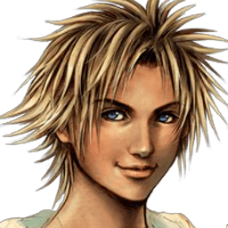

# Retratação Final Fantasy X - Character System (Java)

## Sobre 

Este projeto é um pequeno sistema desenvolvido em Java com foco em Modularização e Programação Orientada a Objetos, inspirado no funcionamento dos personagens e equipamentos de Final Fantasy X.

O objetivo principal do trabalho é simular atributos, armas e bônus aplicados aos personagens do jogo utilizando conceitos como:

- Herança
- Classes abstratas
- Encapsulamento
- Enumerações
- Testes unitários
- Manipulação de atributos
- Cálculo de bônus de equipamentos

---

## Estrutura do Projeto

A classe abstrata `Character` funciona como base para todos os personagens do sistema, contendo atributos principais como:

- HP
- MP
- Strength
- Magic
- Defense
- Agility
- Luck
- Accuracy
- Evasion

Além dos atributos base, o sistema também possui atributos de bônus, permitindo que armas e habilidades modifiquem os status sem alterar permanentemente os valores originais do personagem.

O game possui cerca de 7 personagens jogáveis mas utilizaremos somente do protagonista no momento.

---

## Personagem Tidus

O personagem Tidus foi implementado como uma classe filha de `Character`.

Ele possui:
- atributos iniciais próprios;
- arma equipada;
- possibilidade de troca de armas;
- bônus automáticos aplicados ao trocar equipamento.

---

## Sistema de Armas

As armas do Tidus são representadas através de um `enum`, permitindo fácil controle e expansão futura.

Exemplo:
- LONGSWORD
- BROTHERHOOD

Cada arma pode aplicar bônus específicos aos atributos do personagem.

A arma Brotherhood, por exemplo, aumenta a força do Tidus em 5%.

---

## Sistema de Bônus

Os bônus são calculados na classe `TidusWeaponsAbilities`.

Ao trocar a arma equipada:
1. o personagem atualiza sua arma;
2. o sistema recalcula os bônus automaticamente;
3. os atributos finais são atualizados através dos getters.

Isso evita problemas de acúmulo infinito de status e mantém os atributos base preservados.

---

## Testes Unitários

O projeto também utiliza testes unitários com JUnit para validar:

- troca de armas;
- aplicação correta de bônus;
- atributos finais do personagem;
- comportamento esperado do sistema.

---

## Objetivo Educacional

Este trabalho foi desenvolvido com o objetivo de praticar conceitos fundamentais de Java e Programação Orientada a Objetos de maneira contextualizada e mais próxima de sistemas reais utilizados em jogos RPG.