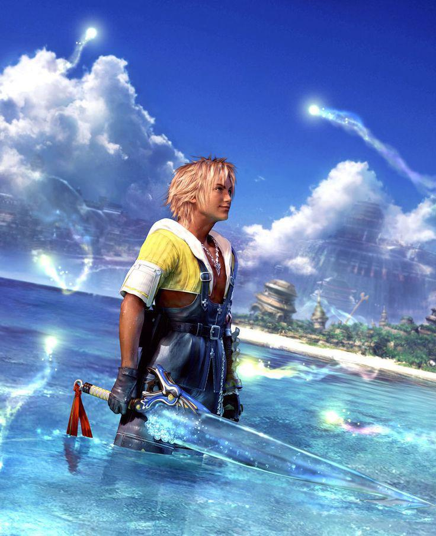
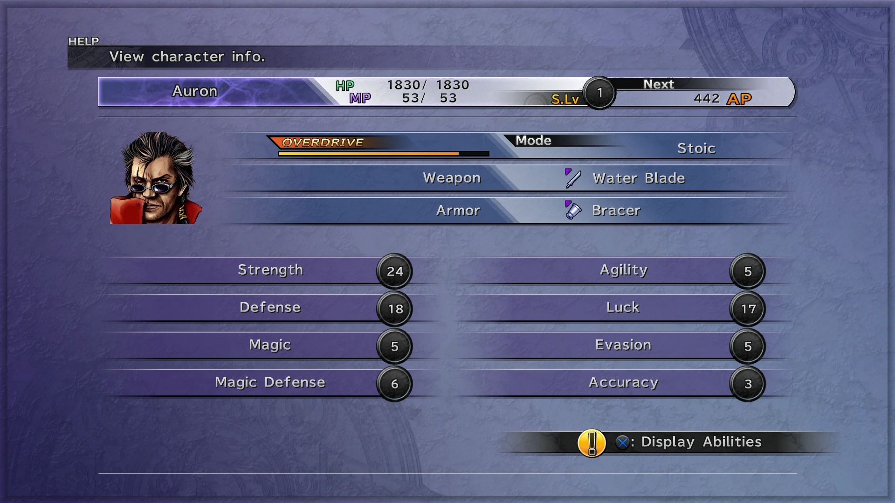
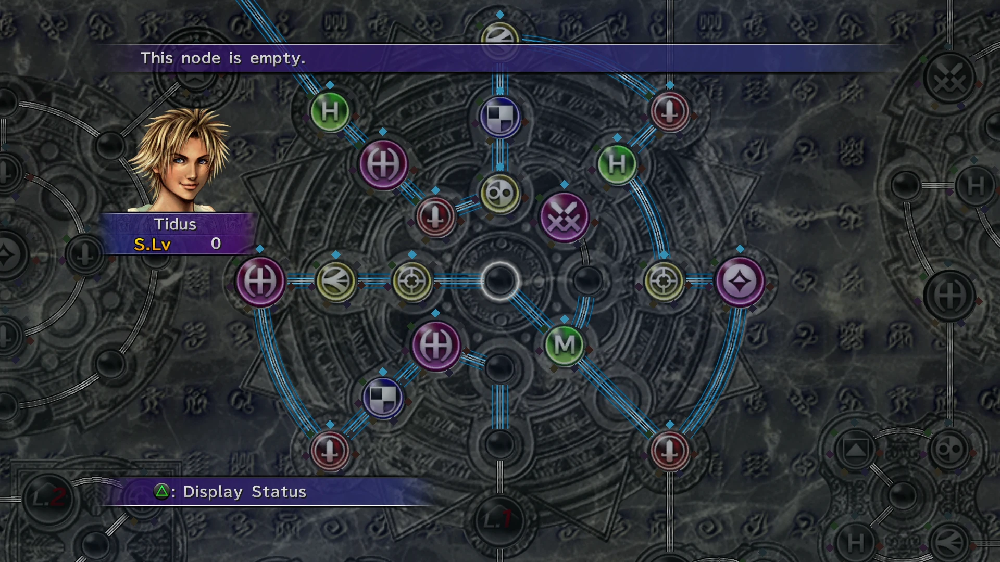
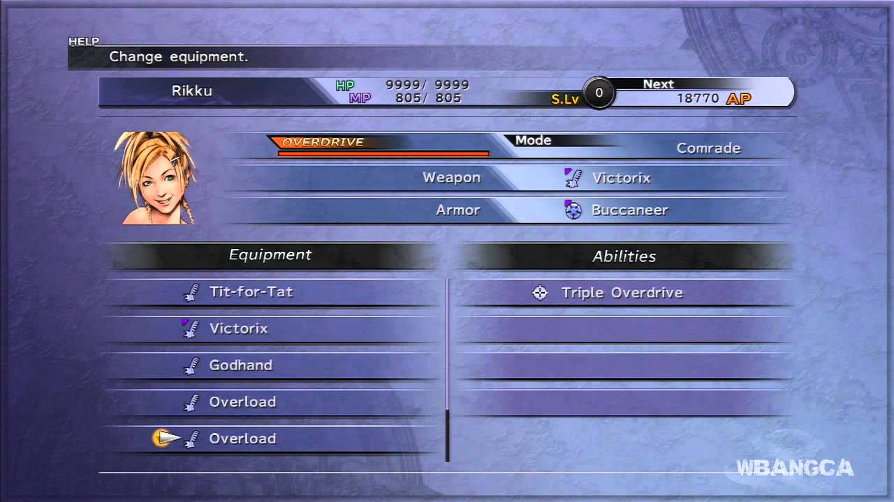
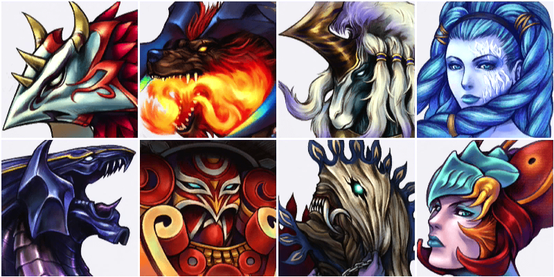

# Como é o jogo original

Final Fantasy X é um RPG eletrônico desenvolvido e publicado pela Square (atualmente Square Enix) para o console PlayStation 2 no ano de 2001. O jogo marcou uma grande evolução para a franquia Final Fantasy por ser o primeiro título da série lançado na sexta geração de consoles, trazendo gráficos em 3D mais avançados, dublagem completa nos diálogos principais e cenas cinematográficas marcantes.

O jogo possui um sistema de batalha em turnos chamado Conditional Turn-Based Battle (CTB), no qual a ordem das ações depende dos atributos e habilidades dos personagens. Além disso, o sistema Sphere Grid permite a personalização do desenvolvimento dos atributos e habilidades de cada integrante da equipe.

A história se passa no mundo fictício de Spira e acompanha Tidus, um jovem jogador de Blitzball que é transportado para um futuro desconhecido após o ataque de uma criatura chamada Sin. Durante sua jornada, Tidus conhece Yuna, uma invocadora que busca derrotar Sin para trazer paz temporária ao mundo. Ao longo da aventura, os personagens enfrentam conflitos relacionados a religião, sacrifício, memória, perda e esperança.

Final Fantasy X é considerado um dos jogos mais marcantes da franquia por sua narrativa emocional, trilha sonora, personagens memoráveis e pela influência que teve nos RPGs japoneses lançados posteriormente.

  
   
  <em>Capa do game</em>

## Sistema

Cada personagem possui atributos específicos, como Strength, Defense, Magic, Agility e Luck, que influenciam diretamente no combate. Além disso, cada integrante da equipe possui funções próprias durante as batalhas, fazendo com que o jogador precise alternar personagens constantemente para enfrentar diferentes tipos de inimigos.

  
   
  <em>Atributos dos Personagens</em>

  
   
  <em>Batalha de encontro normal</em>

Outro sistema importante do jogo é o Sphere Grid, responsável pela evolução dos personagens. Em vez de utilizar um sistema tradicional de níveis com crescimento automático de atributos, o jogador movimenta os personagens em um grande tabuleiro chamado Sphere Grid para desbloquear habilidades, magias e melhorias de atributos de forma personalizada independente da arma equipada.

  
   
  <em>Sphere Grid</em>

O jogo também possui um sistema de equipamentos no qual armas e armaduras podem conceder habilidades especiais e bônus de atributos. Algumas armas possuem efeitos únicos, como aumento de dano, ataques elementais ou melhorias percentuais em atributos específicos.

  
   
  <em>Armas</em>

Além das batalhas, Final Fantasy X apresenta sistemas secundários como invocações (Aeons), minigames, customização de equipamentos e o esporte fictício Blitzball, um dos elementos mais marcantes do jogo.

  
   
  <em>Aeons</em>

